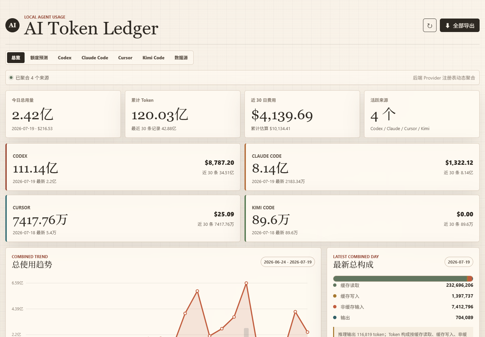
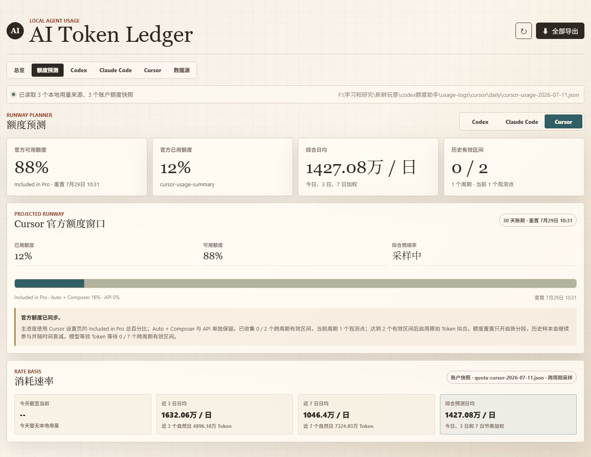
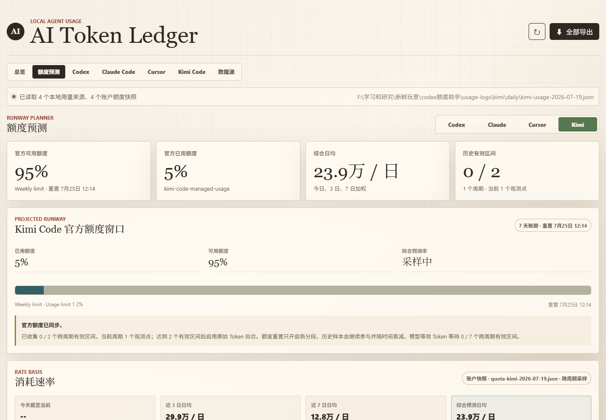
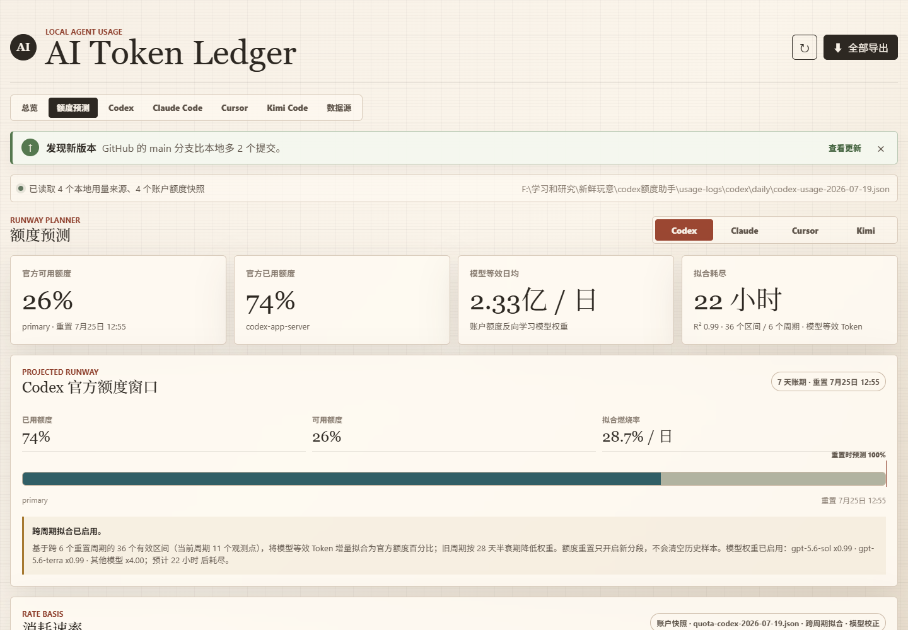
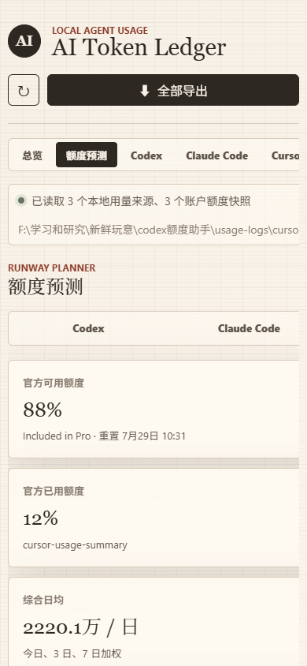
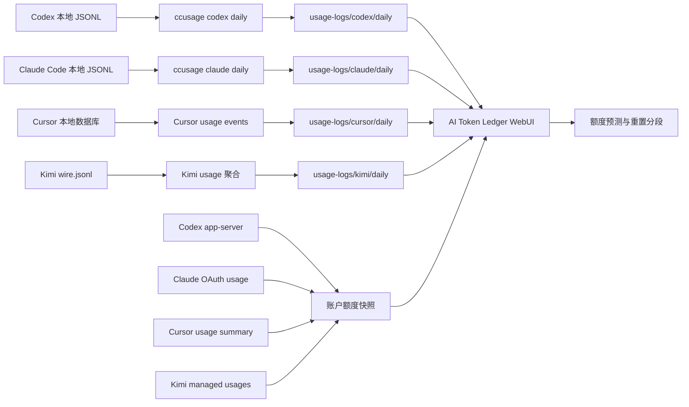

# AI Token Ledger

> 一个 Windows-first 的本地 AI coding agent 用量账本：统一查看 Codex、Claude Code、Cursor 与 Kimi Code 的 token 消耗、账户额度、重置时间和耗尽预测。

`AI Token Ledger` 将本机日志和账户额度快照放在同一个本地仪表盘里。它不需要数据库服务，不上传 usage JSON，也不会把每日导出和 `npx` 缓存写进 C 盘用户目录。

## 界面预览

以下截图来自本地聚合数据示例；数值会随账户和日志变化，截图不包含凭证、cookie 或账户 ID。

### 总览

所有已注册智能体的累计用量、近 30 日估算费用、模型分布、趋势、重置额度与每日明细集中在一页。



### Cursor Pro 额度预测

Cursor 页面使用设置页同口径的 `Included in Pro` 总百分比，并单独保留 `Auto + Composer` 与 `API` 分项；不会把旧计划单位误当成 Pro 额度百分比。



### Kimi Code 额度预测

Kimi 页面同时展示周额度、短窗口进度、本地 token 速度与跨周期预测样本；凭证刷新完全在后端完成。



### 新版本提示

只有 GitHub 远端分支确认领先本地时才显示横幅；关闭后同一远端版本不会再次打扰。



### 移动端

手机端保持完整功能，顶部导航可横向浏览，不会把页面主体撑出视口。



## 能做什么

| 能力 | 说明 |
| --- | --- |
| 多来源用量账本 | 分别展示 Codex、Claude Code、Cursor、Kimi Code；总览由后端注册表动态聚合。 |
| 每日快照 | Codex / Claude Code / all-agent 使用 `ccusage` 导出；Cursor 汇总 usage events；Kimi 汇总本地 `wire.jsonl`。 |
| 官方额度窗口 | 同步四个智能体的当前已用比例、剩余额度、账期或重置时间。 |
| 统一刷新 | 顶部刷新和“全部导出”会刷新全部已注册本地 token 与账户额度源。 |
| 耗尽预测 | 结合今日实时速度、3 日、7 日速度，预测当前额度窗口的消耗节奏。 |
| 模型等效 Token | 样本足够时，从官方额度变化反向学习模型权重；不会拿 API 价格伪装成订阅额度换算。 |
| 日内重置识别 | 上午用完额度、午间重置、下午继续使用时，重置前后的 Token 会自动分段，避免污染拟合。 |
| 重置 credits | Codex 页可显示 reset credit 的可用次数与本地时区有效期。 |
| 新版本提示 | 页面打开时静默检查 GitHub；只有远端 `main` 严格领先本地提交时才显示可关闭提示。 |
| 定时导出 | Windows 计划任务默认每天中午 12:00 运行，即使晚间关机也不影响。 |

## 30 秒开始

### 1. 检查运行环境

当前项目面向 Windows 10/11，建议使用 Node.js 22 或更高版本、PowerShell，以及已经登录的 Codex / Claude Code / Cursor。需要 Kimi 数据时还需安装并登录 Kimi Code CLI。

```powershell
node --version
npx --version
```

本项目使用当前维护的 `ccusage` 命令。旧版 `@ccusage/codex` 用户无需卸载，但导出脚本会执行 `npx -y ccusage@latest`，首次运行时自动下载，无需全局安装。

```powershell
npx -y ccusage@latest codex daily --help
npx -y ccusage@latest claude daily --help
npx -y ccusage@latest daily --help
```

Kimi Code 是可选来源；安装后运行一次登录即可。仪表盘只读取它自己的凭证文件与本地 usage 记录，不要求把 token 填进本项目。

```powershell
npm install -g @moonshot-ai/kimi-code
kimi login
```

### 2. 导出第一份数据

```powershell
cd "F:\学习和研究\新鲜玩意\codex额度助手"
npm run export
```

也可以直接运行 PowerShell 脚本：

```powershell
powershell -NoProfile -ExecutionPolicy Bypass -File .\scripts\export-all-daily.ps1
```

### 3. 打开仪表盘

最简单的方式是双击项目根目录中的 `打开仪表盘.bat`，或在 PowerShell 中运行：

```powershell
powershell -NoProfile -ExecutionPolicy Bypass -File .\scripts\open-dashboard.ps1 -Port 8787
```

浏览器地址：<http://127.0.0.1:8787>

开发时也可以直接启动：

```powershell
npm start
```

## 工作原理



点击顶部刷新或“全部导出”时，系统固定按以下顺序执行：

1. 从后端注册表读取所有 `ccusage` 来源并导出当日 JSON。
2. 同步 Codex、Claude Code、Cursor、Kimi Code 的账户额度与本地事件来源。
3. 记录去重后的分段观测点。
4. 重新读取当前页面；不管停留在哪个标签页，看到的都是同一轮数据。

## 页面说明

| 页面 | 适合查看的内容 |
| --- | --- |
| `总览` | 全部已注册来源的整体比较、总趋势、可滚动模型分布和每日总账。 |
| `额度预测` | 全部支持额度同步的 Provider 的剩余额度、重置时间、速度与耗尽预测。 |
| `Codex` | Codex 的每日趋势、缓存构成、费用、模型、快照、reset credits。 |
| `Claude Code` | Claude Code 的每日趋势、缓存构成、费用、模型、快照。 |
| `Cursor` | Cursor usage events 汇总的独立 token 使用明细。 |
| `Kimi Code` | Kimi `usage.record` 的本地 token 明细、周额度和短窗口。 |
| `数据源` | 日志目录、检测状态、每日快照和额度观测点数量。 |

页面首次打开只读取已有 JSON，不会自动执行 `npx`。需要最新数据时再点右上角刷新，避免每次打开浏览器都触发导出。

页面打开时还会请求本地 `/api/update-status`。后端使用 [GitHub Compare API](https://docs.github.com/en/rest/commits/commits#compare-two-commits) 判断远端 `main` 是否是本地提交的严格后继；网络中断、API 限流、仓库分叉、本地领先或无法读取 Git 状态时均保持静默。结果缓存 5 分钟。关闭提示后会按远端提交版本记忆，直到 GitHub 出现更新的提交才再次显示。

## 数据源与账户同步

| 来源 | 本地 token 数据 | 账户额度数据 | 自动周期 |
| --- | --- | --- | --- |
| Codex | `ccusage codex daily --json` | 本机 `codex app-server` 的 `account/rateLimits/read` | 5 小时 / 周窗口与重置时间 |
| Claude Code | `ccusage claude daily --json` | 本机 Claude OAuth 登录态请求 usage 窗口 | 5 小时 / 7 天窗口与重置时间 |
| Cursor | 最近 90 天 Cursor usage events 聚合 | Cursor usage summary | Cursor 账期、Included in Pro、Auto + Composer、API |
| Kimi Code | `~/.kimi-code/sessions/**/wire.jsonl` 中 turn-scoped `usage.record` | Kimi Code managed usage | 周额度、短窗口与重置时间 |

### Codex

Codex 的额度来自本机 CLI 的 app-server，因此不会把 Codex 登录 token 返回给浏览器。页面还会读取 reset credits 的数量和有效期，但只展示汇总字段。

### Claude Code

Claude Code 的本地 token 明细来自 JSONL；额度窗口来自本机登录态。若凭证失效、网络不可用或账户接口调整，面板会保留上一次成功快照并显示同步失败，而不会清空历史数据。

### Cursor Pro

Cursor 的旧 `plan.used / plan.limit` 单位与“Included in Pro”百分比不是同一件事。项目将设置页同口径的总百分比作为主要额度进度，同时展示 `Auto + Composer`、`API` 和账期；旧单位只作为诊断数据保留，不参与 Pro 百分比预测。

### Kimi Code

Kimi token 明细来自本机 Kimi Code 会话中的 turn 级 usage 事件，缓存读取、缓存写入、普通输入和输出分别聚合。额度来自 Kimi Code CLI 使用的 managed usage 接口；过期 access token 会使用官方 OAuth refresh 流程在本机刷新，并原子更新 Kimi 自己的凭证文件。任何 token、cookie 或完整设备 ID 都不会返回 WebUI 或写入项目日志。

## 额度预测：原始 Token、模型等效 Token 与重置

### 为什么不直接按 API 价格换算？

不同模型、缓存命中、上下文规模、任务形态都会影响订阅额度的内部扣减。API 价格可用于成本估算，但不等同于 Codex、Claude 或 Cursor 的订阅限额消耗。因此，面板不会把 API 单价硬编码为“额度 Token 权重”。

### 预测分层

| 阶段 | 条件 | 面板行为 |
| --- | --- | --- |
| 观察期 | 历史不足 2 个有效消耗区间 | 显示官方额度、重置时间、今日 / 3 日 / 7 日原始 Token 速度。 |
| 单变量拟合 | 历史累计至少 2 个有效区间 | 汇总保留期内各重置周期的 Token 增量和额度百分比增量，显示 `R²` 与预测耗尽时间。 |
| 模型等效 Token | 至少 7 个跨周期有效区间，且模型占比存在显著变化 | 使用岭回归反向学习模型相对权重；权重受先验与 `0.25x - 4x` 范围约束。 |

单变量拟合采用“分段固定起点”：每个额度周期只计算周期内部增量，避免把重置前后的百分比跳变当作消耗；随后把所有周期的有效区间合并学习同一条燃烧率。旧数据不会因重置被删除，而是按 28 天半衰期逐渐降低权重，近期使用习惯更能影响预测。异常区间还会通过稳健权重降权。

如果样本不足、模型一直不变、模型混合没有足够变化，或加权拟合质量更差，系统会自动退回原始 Token 单斜率。这里的“模型等效 Token”只对当前账户和当前保留期内的观测数据有效，不是官方公开换算率。

### 如果额度在一天内被重置

每次有效刷新都会写入一个紧凑观测点，记录当前长周期窗口、已用比例、重置时间、累计 Token 和分模型汇总。下列任一情况会自动切换到新分段：

- `resetsAt` 变化超过 5 分钟；
- 官方已用百分比下降超过 0.5 个百分点；
- 本地累计 Token 计数回退。

因此“上午用完，午间重置，下午继续跑”的 Token 不会和上午额度消耗混在同一条拟合曲线上。5 分钟容差用来吸收部分账户接口返回的毫秒级重置时间抖动。

开启新分段不等于从头拟合。重置前已经形成的有效区间仍会用于估计燃烧率；新周期的已用比例、剩余比例和截止时间只负责当前状态。即使新周期暂时只有一个观测点，只要历史已有两个有效区间，面板也可以立即给出预测。

同一天可以连续创建多个重置分段，并不只支持一次重置。每日观测文件仍限制为 96 条；超过限制时会优先保留每个分段的首尾点和重置边界，再用较新的普通观测填满剩余位置，避免当天早些时候的重置证据被高频刷新挤掉。

重置识别依赖同步时看到的账户状态。若两次重置都完整发生在相邻两次同步之间，并且最终已用比例、累计 Token 与 `resetsAt` 没有留下可观察跳变，任何本地快照方案都无法事后还原中间边界。手动使用 reset credit 后，建议尽快点击页面右上角刷新，确保新周期至少留下一个观测锚点。

完整设计说明见：[额度等效 Token 与重置分段设计](docs/plans/2026-07-10-quota-equivalent-token-design.md)。

## 扩展新的智能体

Provider 定义统一放在后端 [`providers/registry.js`](providers/registry.js)。前端不会包含一份平行的智能体名单，而是从 `/api/providers` 读取经过筛选的名称、颜色和能力标记，自动生成导航、总览卡片、独立用量页和预测标签。

如果新工具能复用现有采集方式，只需在注册表增加一个条目并填写以下后端字段：

| 字段 | 用途 |
| --- | --- |
| `id / label / color` | 稳定标识与展示信息。 |
| `detectPaths` | 判断本机是否安装或登录。 |
| `usage.adapter` | `ccusage`、账户事件或本地 wire 日志适配器。 |
| `usage.filePrefix / logRoot` | 每日覆盖快照的文件名和目录。 |
| `quota.adapter` | 官方账户额度规范化适配器。 |
| `forecast / navigation` | 是否生成预测和独立页面。 |

如果协议完全不同，只需在 `scripts/sync-account-quotas.mjs` 的后端 adapter map 新增采集函数，再在注册表引用它；无需修改 `web/index.html` 或增加新的前端分支。注册表返回给浏览器的对象由 `publicProvider()` 白名单生成，不含凭证路径、接口地址、命令参数或 adapter 名称。

## 每日自动导出

默认建议每天中午 12:00 导出，避开晚间关机。

```powershell
powershell -NoProfile -ExecutionPolicy Bypass -File .\scripts\register-daily-task.ps1 -At 12:00 -Timezone Asia/Tokyo
```

如果已有任务需要覆盖：

```powershell
powershell -NoProfile -ExecutionPolicy Bypass -File .\scripts\register-daily-task.ps1 -At 12:00 -Timezone Asia/Tokyo -Force
```

旧版用户若机器上已有 `CodexUsageDailyExport`，可以原地替换为全量同步任务：

```powershell
powershell -NoProfile -ExecutionPolicy Bypass -File .\scripts\register-daily-task.ps1 `
  -TaskName CodexUsageDailyExport `
  -At 12:00 `
  -Timezone Asia/Tokyo `
  -Force
```

查看任务：

```powershell
Get-ScheduledTaskInfo -TaskName AITokenLedgerDailyExport
```

删除任务：

```powershell
Unregister-ScheduledTask -TaskName AITokenLedgerDailyExport -Confirm:$false
```

如果你使用旧任务名，请把上面两条命令中的任务名替换为 `CodexUsageDailyExport`。

## 常用命令

```powershell
# 运行单元测试
npm test

# 导出全部本地 token 数据并同步账户额度
npm run export

# 只导出 Codex / Claude / all-agent JSON
npm run export:codex
npm run export:claude
npm run export:all

# 只同步 Kimi 本地 token 与账户额度
npm run export:kimi

# 启动本地 WebUI
npm start
```

默认 `ccusage` 导出时区是 `Asia/Tokyo`。如果希望改为上海时区：

```powershell
powershell -NoProfile -ExecutionPolicy Bypass -File .\scripts\export-all-daily.ps1 -Timezone Asia/Shanghai
```

## 本地文件与存储控制

```text
usage-logs/
├─ codex/daily/                 # 每天一个 Codex JSON
├─ claude/daily/                # 每天一个 Claude Code JSON
├─ cursor/daily/                # 每天一个 Cursor events 聚合 JSON
├─ kimi/daily/                  # 每天一个 Kimi wire 聚合 JSON
├─ all/daily/                   # 每天一个 all-agent 聚合 JSON
├─ quota-snapshots/             # 每来源每天一个账户额度快照
├─ quota-observations/          # 每来源每天一个观测文件，最多 96 条
```

存储策略：

- token 快照与额度快照：同一天重复运行会覆盖同名 JSON。
- 额度观测：每来源每天一个文件，最多 96 个去重观测点，自动保留 120 天。
- `npx` 缓存：默认位于项目内的 `.npm-cache`。
- 所有上述运行数据都在 `.gitignore` 中，不会被提交到 GitHub。

旧的 `codex-usage-logs/daily` 会作为读取 fallback；新版数据会优先写到 `usage-logs/codex/daily`。

## 隐私与统计边界

### 不会写入项目或提交的内容

- Codex / Claude / Cursor / Kimi 的 access token、refresh token、cookie；
- 邮箱、完整账户 ID、会话内容、原始 Cursor events；
- `usage-logs/`、`codex-usage-logs/`、`.npm-cache/`、`verification/`、`node_modules/`。

账户凭证只在本机内存中，用于向对应服务读取自己的账户用量；本地 WebUI 不会把它们返回给浏览器。

### 这个项目回答什么问题

它很适合回答：

> 我这台机器上的 Codex / Claude Code / Cursor / Kimi Code，最近每天消耗了多少 token？当前额度还剩多少？按现在速度能用多久？

它不能保证：

> 本地 token 总数与订阅产品内部扣减绝对相等。

官方内部扣减仍可能受 plan、模型、缓存、上下文、任务复杂度、云端执行与平台策略影响。预测页优先展示官方额度比例和重置时间；本地 token 用于解释速度与趋势。

## 常见问题

### 页面显示没有数据

先运行一次全量导出：

```powershell
npm run export
```

然后刷新 <http://127.0.0.1:8787>。

### Claude Code 页没有 token 数据

检查本机日志和 `ccusage`：

```powershell
Test-Path "$HOME\.claude"
npx -y ccusage@latest claude daily --json
```

如果命令本身没有数据，WebUI 也不会有 Claude Code 明细。

### 账户额度同步失败

常见原因是网络不可用、CLI 未登录、OAuth 凭证失效，或账户接口结构调整。面板会保留最近成功快照；重新登录相应客户端后点击顶部刷新即可重试。Kimi 可运行 `kimi login` 重新建立登录态。

### 端口 8787 被占用

```powershell
powershell -NoProfile -ExecutionPolicy Bypass -File .\scripts\start-webui.ps1 -Port 8790
```

然后访问 <http://127.0.0.1:8790>。

### 双击脚本后窗口闪退

在 PowerShell 中运行即可看到错误：

```powershell
powershell -NoProfile -ExecutionPolicy Bypass -File .\scripts\open-dashboard.ps1 -Port 8787
```

重点检查 Node.js 是否安装、版本是否至少为 22，以及 `node` 是否在 `PATH` 中。

## 项目结构

```text
.
├─ 打开仪表盘.bat
├─ open-dashboard.bat
├─ package.json
├─ server.js
├─ README.md
├─ lib/
│  └─ update-check.js
├─ providers/
│  └─ registry.js
├─ docs/
│  ├─ assets/
│  └─ plans/
├─ scripts/
│  ├─ export-all-daily.ps1
│  ├─ export-daily.ps1
│  ├─ open-dashboard.ps1
│  ├─ provider-config.mjs
│  ├─ register-daily-task.ps1
│  ├─ start-webui.ps1
│  └─ sync-account-quotas.mjs
├─ tests/
│  ├─ forecast-model.test.js
│  ├─ provider-registry.test.js
│  └─ update-check.test.js
└─ web/
   ├─ app.js
   ├─ forecast-model.js
   ├─ index.html
   └─ styles.css
```

## 开发与验证

```powershell
npm test
node --check server.js
node --check web/app.js
node --check web/forecast-model.js
```

测试覆盖模型等效 Token、模型混合不可辨识时的降级、同日多观测点、额度重置分段、Provider 元数据脱敏，以及 Kimi token/额度规范化。
