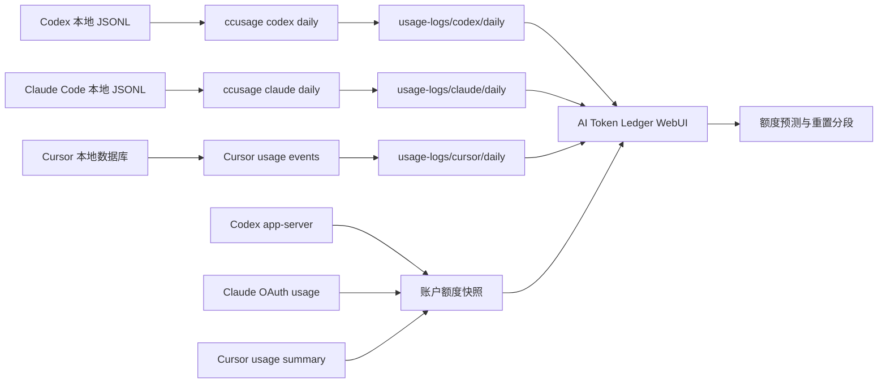

# AI Token Ledger

> 一个 Windows-first 的本地 AI coding agent 用量账本：统一查看 Codex、Claude Code 与 Cursor 的 token 消耗、账户额度、重置时间和耗尽预测。

`AI Token Ledger` 将本机日志和账户额度快照放在同一个本地仪表盘里。它不需要数据库服务，不上传 usage JSON，也不会把每日导出和 `npx` 缓存写进 C 盘用户目录。

## 界面预览

以下截图来自本地聚合数据示例；数值会随账户和日志变化，截图不包含凭证、cookie 或账户 ID。

### 总览

Codex、Claude Code、Cursor 的累计用量、近 30 日估算费用、模型分布、趋势、重置额度与每日明细集中在一页。


### Cursor Pro 额度预测

Cursor 页面使用设置页同口径的 `Included in Pro` 总百分比，并单独保留 `Auto + Composer` 与 `API` 分项；不会把旧计划单位误当成 Pro 额度百分比。


### 移动端

手机端保持完整功能，顶部导航可横向浏览，不会把页面主体撑出视口。


## 能做什么

| 能力 | 说明 |
| --- | --- |
| 多来源用量账本 | 分别展示 Codex、Claude Code、Cursor；总览可同时比较三者。 |
| 每日快照 | Codex / Claude Code / all-agent 使用 `ccusage` 导出为当天覆盖式 JSON。Cursor 自动汇总最近 90 天 usage events。 |
| 官方额度窗口 | 同步 Codex、Claude Code、Cursor 的当前已用比例、剩余额度、账期或重置时间。 |
| 统一刷新 | 顶部刷新和“全部导出”会同时刷新三个本地 token 源与三个账户额度源。 |
| 耗尽预测 | 结合今日实时速度、3 日、7 日速度，预测当前额度窗口的消耗节奏。 |
| 模型等效 Token | 样本足够时，从官方额度变化反向学习模型权重；不会拿 API 价格伪装成订阅额度换算。 |
| 日内重置识别 | 上午用完额度、午间重置、下午继续使用时，重置前后的 Token 会自动分段，避免污染拟合。 |
| 重置 credits | Codex 页可显示 reset credit 的可用次数与本地时区有效期。 |
| 定时导出 | Windows 计划任务默认每天中午 12:00 运行，即使晚间关机也不影响。 |

## 30 秒开始

### 1. 检查运行环境

当前项目面向 Windows 10/11，建议使用 Node.js 22 或更高版本、PowerShell 以及已经登录的 Codex / Claude Code / Cursor。

```powershell
node --version
npx --version
```

本项目使用当前维护的 `ccusage` 命令。旧版 `@ccusage/codex` 用户无需卸载，但导出脚本会执行 `npx -y ccusage@latest`，首次运行时自动下载，无需全局安装。

```powershell
npx -y ccusage@latest codex daily --help
npx -y ccusage@latest claude daily --help
npx -y ccusage@latest daily --help
```

### 2. 导出第一份数据

```powershell
cd "F:\学习和研究\新鲜玩意\codex额度助手"
npm run export
```

也可以直接运行 PowerShell 脚本：

```powershell
powershell -NoProfile -ExecutionPolicy Bypass -File .\scripts\export-all-daily.ps1
```

### 3. 打开仪表盘

最简单的方式是双击项目根目录中的 `打开仪表盘.bat`，或在 PowerShell 中运行：

```powershell
powershell -NoProfile -ExecutionPolicy Bypass -File .\scripts\open-dashboard.ps1 -Port 8787
```

浏览器地址：<http://127.0.0.1:8787>

开发时也可以直接启动：

```powershell
npm start
```

## 工作原理



点击顶部刷新或“全部导出”时，系统固定按以下顺序执行：

1. 导出 Codex、Claude Code 与 all-agent 的当日 JSON。
2. 同步 Codex、Claude Code、Cursor 的账户额度窗口。
3. 记录去重后的分段观测点。
4. 重新读取当前页面；不管停留在哪个标签页，看到的都是同一轮数据。

## 页面说明

| 页面 | 适合查看的内容 |
| --- | --- |
| `总览` | 三个来源的整体比较、总趋势、模型分布、每日总账。 |
| `额度预测` | Codex / Claude Code / Cursor 的官方剩余额度、重置时间、速度与耗尽预测。 |
| `Codex` | Codex 的每日趋势、缓存构成、费用、模型、快照、reset credits。 |
| `Claude Code` | Claude Code 的每日趋势、缓存构成、费用、模型、快照。 |
| `Cursor` | Cursor usage events 汇总的独立 token 使用明细。 |
| `数据源` | 日志目录、检测状态、每日快照和额度观测点数量。 |

页面首次打开只读取已有 JSON，不会自动执行 `npx`。需要最新数据时再点右上角刷新，避免每次打开浏览器都触发导出。

## 数据源与账户同步

| 来源 | 本地 token 数据 | 账户额度数据 | 自动周期 |
| --- | --- | --- | --- |
| Codex | `ccusage codex daily --json` | 本机 `codex app-server` 的 `account/rateLimits/read` | 5 小时 / 周窗口与重置时间 |
| Claude Code | `ccusage claude daily --json` | 本机 Claude OAuth 登录态请求 usage 窗口 | 5 小时 / 7 天窗口与重置时间 |
| Cursor | 最近 90 天 Cursor usage events 聚合 | Cursor usage summary | Cursor 账期、Included in Pro、Auto + Composer、API |

### Codex

Codex 的额度来自本机 CLI 的 app-server，因此不会把 Codex 登录 token 返回给浏览器。页面还会读取 reset credits 的数量和有效期，但只展示汇总字段。

### Claude Code

Claude Code 的本地 token 明细来自 JSONL；额度窗口来自本机登录态。若凭证失效、网络不可用或账户接口调整，面板会保留上一次成功快照并显示同步失败，而不会清空历史数据。

### Cursor Pro

Cursor 的旧 `plan.used / plan.limit` 单位与“Included in Pro”百分比不是同一件事。项目将设置页同口径的总百分比作为主要额度进度，同时展示 `Auto + Composer`、`API` 和账期；旧单位只作为诊断数据保留，不参与 Pro 百分比预测。

## 额度预测：原始 Token、模型等效 Token 与重置

### 为什么不直接按 API 价格换算？

不同模型、缓存命中、上下文规模、任务形态都会影响订阅额度的内部扣减。API 价格可用于成本估算，但不等同于 Codex、Claude 或 Cursor 的订阅限额消耗。因此，面板不会把 API 单价硬编码为“额度 Token 权重”。

### 预测分层

| 阶段 | 条件 | 面板行为 |
| --- | --- | --- |
| 观察期 | 当前重置分段少于 3 个观测点 | 显示官方额度、重置时间、今日 / 3 日 / 7 日原始 Token 速度。 |
| 单变量拟合 | 至少 3 个观测点 | 对 Token 增量和官方已用百分比进行最小二乘拟合，显示 `R²` 与预测耗尽时间。 |
| 模型等效 Token | 至少 7 个观测点，且模型占比存在显著变化 | 使用岭回归反向学习模型相对权重；权重受先验与 `0.25x - 4x` 范围约束。 |

如果样本不足、模型一直不变、模型混合没有足够变化，或加权拟合质量更差，系统会自动退回原始 Token 单斜率。这里的“模型等效 Token”只对当前账户、当前周期和当前观测数据有效，不是官方公开换算率。

### 如果额度在一天内被重置

每次有效刷新都会写入一个紧凑观测点，记录当前长周期窗口、已用比例、重置时间、累计 Token 和分模型汇总。下列任一情况会自动切换到新分段：

- `resetsAt` 变化超过 5 分钟；
- 官方已用百分比下降超过 0.5 个百分点；
- 本地累计 Token 计数回退。

因此“上午用完，午间重置，下午继续跑”的 Token 不会和上午额度消耗混在同一条拟合曲线上。5 分钟容差用来吸收部分账户接口返回的毫秒级重置时间抖动。

完整设计说明见：[额度等效 Token 与重置分段设计](docs/plans/2026-07-10-quota-equivalent-token-design.md)。

## 每日自动导出

默认建议每天中午 12:00 导出，避开晚间关机。

```powershell
powershell -NoProfile -ExecutionPolicy Bypass -File .\scripts\register-daily-task.ps1 -At 12:00 -Timezone Asia/Tokyo
```

如果已有任务需要覆盖：

```powershell
powershell -NoProfile -ExecutionPolicy Bypass -File .\scripts\register-daily-task.ps1 -At 12:00 -Timezone Asia/Tokyo -Force
```

旧版用户若机器上已有 `CodexUsageDailyExport`，可以原地替换为全量同步任务：

```powershell
powershell -NoProfile -ExecutionPolicy Bypass -File .\scripts\register-daily-task.ps1 `
  -TaskName CodexUsageDailyExport `
  -At 12:00 `
  -Timezone Asia/Tokyo `
  -Force
```

查看任务：

```powershell
Get-ScheduledTaskInfo -TaskName AITokenLedgerDailyExport
```

删除任务：

```powershell
Unregister-ScheduledTask -TaskName AITokenLedgerDailyExport -Confirm:$false
```

如果你使用旧任务名，请把上面两条命令中的任务名替换为 `CodexUsageDailyExport`。

## 常用命令

```powershell
# 运行单元测试
npm test

# 导出全部本地 token 数据并同步账户额度
npm run export

# 只导出 Codex / Claude / all-agent JSON
npm run export:codex
npm run export:claude
npm run export:all

# 启动本地 WebUI
npm start
```

默认 `ccusage` 导出时区是 `Asia/Tokyo`。如果希望改为上海时区：

```powershell
powershell -NoProfile -ExecutionPolicy Bypass -File .\scripts\export-all-daily.ps1 -Timezone Asia/Shanghai
```

## 本地文件与存储控制

```text
usage-logs/
├─ codex/daily/                 # 每天一个 Codex JSON
├─ claude/daily/                # 每天一个 Claude Code JSON
├─ cursor/daily/                # 每天一个 Cursor events 聚合 JSON
├─ all/daily/                   # 每天一个 all-agent 聚合 JSON
├─ quota-snapshots/             # 每来源每天一个账户额度快照
├─ quota-observations/          # 每来源每天一个观测文件，最多 96 条
└─ forecast-settings.json       # 页面中的本地后备设置
```

存储策略：

- token 快照与额度快照：同一天重复运行会覆盖同名 JSON。
- 额度观测：每来源每天一个文件，最多 96 个去重观测点，自动保留 120 天。
- `npx` 缓存：默认位于项目内的 `.npm-cache`。
- 所有上述运行数据都在 `.gitignore` 中，不会被提交到 GitHub。

旧的 `codex-usage-logs/daily` 会作为读取 fallback；新版数据会优先写到 `usage-logs/codex/daily`。

## 隐私与统计边界

### 不会保存或提交的内容

- Codex / Claude / Cursor 的 access token、refresh token、cookie；
- 邮箱、完整账户 ID、会话内容、原始 Cursor events；
- `usage-logs/`、`codex-usage-logs/`、`.npm-cache/`、`verification/`、`node_modules/`。

账户凭证只在本机内存中，用于向对应服务读取自己的账户用量；本地 WebUI 不会把它们返回给浏览器。

### 这个项目回答什么问题

它很适合回答：

> 我这台机器上的 Codex / Claude Code / Cursor，最近每天消耗了多少 token？当前额度还剩多少？按现在速度能用多久？

它不能保证：

> 本地 token 总数与订阅产品内部扣减绝对相等。

官方内部扣减仍可能受 plan、模型、缓存、上下文、任务复杂度、云端执行与平台策略影响。预测页优先展示官方额度比例和重置时间；本地 token 用于解释速度与趋势。

## 常见问题

### 页面显示没有数据

先运行一次全量导出：

```powershell
npm run export
```

然后刷新 <http://127.0.0.1:8787>。

### Claude Code 页没有 token 数据

检查本机日志和 `ccusage`：

```powershell
Test-Path "$HOME\.claude"
npx -y ccusage@latest claude daily --json
```

如果命令本身没有数据，WebUI 也不会有 Claude Code 明细。

### 账户额度同步失败

常见原因是网络不可用、CLI 未登录、OAuth 凭证失效、Cursor 未登录，或第三方账户接口结构调整。面板会保留最近成功快照；重新登录相应客户端后点击顶部刷新即可重试。

### 端口 8787 被占用

```powershell
powershell -NoProfile -ExecutionPolicy Bypass -File .\scripts\start-webui.ps1 -Port 8790
```

然后访问 <http://127.0.0.1:8790>。

### 双击脚本后窗口闪退

在 PowerShell 中运行即可看到错误：

```powershell
powershell -NoProfile -ExecutionPolicy Bypass -File .\scripts\open-dashboard.ps1 -Port 8787
```

重点检查 Node.js 是否安装、版本是否至少为 22，以及 `node` 是否在 `PATH` 中。

## 项目结构

```text
.
├─ 打开仪表盘.bat
├─ open-dashboard.bat
├─ package.json
├─ server.js
├─ README.md
├─ docs/
│  ├─ assets/
│  └─ plans/
├─ scripts/
│  ├─ export-all-daily.ps1
│  ├─ export-daily.ps1
│  ├─ open-dashboard.ps1
│  ├─ register-daily-task.ps1
│  ├─ start-webui.ps1
│  └─ sync-account-quotas.mjs
├─ tests/
│  └─ forecast-model.test.js
└─ web/
   ├─ app.js
   ├─ forecast-model.js
   ├─ index.html
   └─ styles.css
```

## 开发与验证

```powershell
npm test
node --check server.js
node --check web/app.js
node --check web/forecast-model.js
```

测试覆盖模型等效 Token、模型混合不可辨识时的降级、同日多观测点，以及额度重置分段判定。
