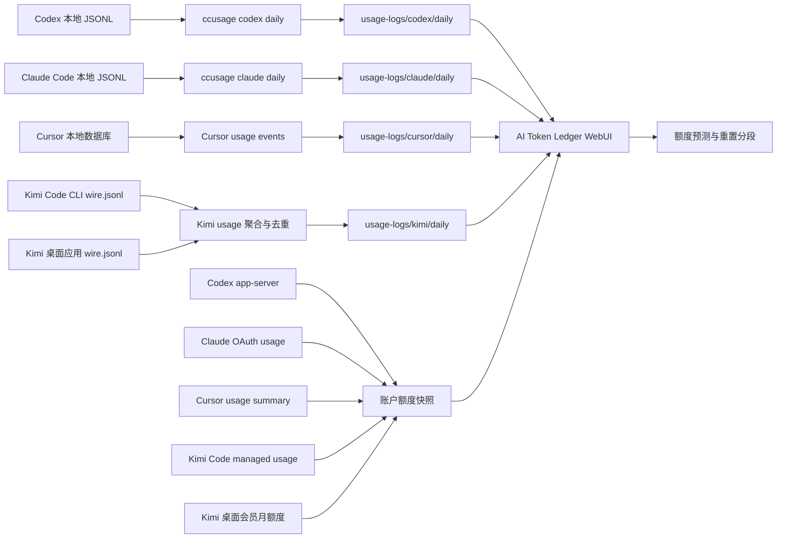

# AI Token Ledger

> 面向 Windows 的本地 AI 编程助手用量仪表盘，集中展示 Codex、Claude Code、Cursor 与 Kimi 的 token 消耗、账户额度、重置时间和耗尽预测。

`AI Token Ledger` 将本机日志和账户额度快照集中到一个本地仪表盘中。程序直接读取本地文件，不依赖数据库；usage JSON、每日导出和 `npx` 缓存均保存在项目目录中。

## 界面预览

以下截图来自本地聚合数据示例；数值会随账户和日志变化，截图不包含凭证、cookie 或账户 ID。

### 总览

所有已注册智能体的累计用量、近 30 日估算费用、模型分布、每日 Token 热力图、趋势、重置额度与每日明细集中在一页。


### Cursor Pro 额度预测

Cursor 页面使用设置页同口径的 `Included in Pro` 总百分比，并保留 `Auto + Composer` 与 `API` 分项。旧计划单位仅作为诊断数据保存，不计入 Pro 额度预测。


### Kimi 额度预测

Kimi 页面分别展示会员月总额度和 Kimi Code 周额度。两个窗口各自记录已用比例、重置时间、观测分段和耗尽预测，月度窗口还显示 Kimi / Code 构成。凭证由后端读取。5 小时窗口保存在原始账户快照中，不进入预测页。


### 新版本提示

程序确认 GitHub 远端分支领先本地版本后显示更新横幅。关闭横幅后，同一远端版本不再重复提示。


### 移动端

手机端保留完整功能，顶部导航支持横向滚动，页面主体保持在视口范围内。


## 功能

| 能力 | 说明 |
| --- | --- |
| 多来源用量账本 | 分别展示 Codex、Claude Code、Cursor、Kimi Code；总览由后端注册表动态聚合。 |
| 每日快照 | Codex / Claude Code / all-agent 使用 `ccusage` 导出；Cursor 汇总 usage events；Kimi 汇总本地 `wire.jsonl`。 |
| 日历热力图 | 总览按天展示最近最多 53 周的 Token 用量，颜色深浅反映各活跃日的相对用量。 |
| 官方额度窗口 | 同步四个智能体的当前已用比例、剩余额度、账期或重置时间。 |
| 统一刷新 | 顶部刷新和“全部导出”会刷新全部已注册本地 token 与账户额度源。 |
| 耗尽预测 | 结合今日实时速度以及近 3 日、7 日速度，估计当前额度窗口的耗尽时间。 |
| 模型等效 Token | 样本足够时，根据官方额度变化估计模型权重；API 价格不参与订阅额度换算。 |
| 日内重置识别 | 上午用完额度、午间重置、下午继续使用时，重置前后的 Token 会自动分段，避免污染拟合。 |
| 重置 credits | Codex 页可显示 reset credit 的可用次数与本地时区有效期。 |
| 新版本提示 | 页面打开时静默检查 GitHub；只有远端 `main` 严格领先本地提交时才显示可关闭提示。 |
| 定时导出 | Windows 计划任务默认每天中午 12:00 运行。 |

## 快速开始

### 1. 检查运行环境

当前项目面向 Windows 10/11，建议使用 Node.js 22 或更高版本、PowerShell，以及已经登录的 Codex / Claude Code / Cursor。Kimi 官方桌面应用和 Kimi Code CLI 的本地 token 都可读取；会员月总额来自已登录的 Kimi 桌面应用，周额度来自已登录的 Kimi Code CLI。

```powershell
node --version
npx --version
```

本项目使用当前维护的 `ccusage` 命令。导出脚本优先调用 `PATH` 中已安装的 `ccusage`，以减少刷新时的启动等待；若系统中没有该命令，则使用项目缓存运行 `npx -y ccusage@latest`。可按下面的命令全局安装：

```powershell
npm install -g ccusage@latest
ccusage --version

# 未全局安装时使用 npx
npx -y ccusage@latest codex daily --help
npx -y ccusage@latest claude daily --help
npx -y ccusage@latest daily --help
```

Kimi 是可选来源。使用官方桌面应用时，每日 token 来自其中的 Kimi Code 日志，会员月总额及 Kimi / Code 构成来自桌面应用登录态。Kimi Code 周额度需要安装 CLI 并完成登录。登录凭证由客户端保管，无需手动填写到项目中。

```powershell
npm install -g @moonshot-ai/kimi-code
kimi login
```

### 2. 导出第一份数据

```powershell
cd "path\to\codex_token_visualization"
npm run export
```

也可以直接运行 PowerShell 脚本：

```powershell
powershell -NoProfile -ExecutionPolicy Bypass -File .\scripts\export-all-daily.ps1
```

### 3. 打开仪表盘

双击项目根目录中的 `打开仪表盘.bat`，或在 PowerShell 中运行：

```powershell
powershell -NoProfile -ExecutionPolicy Bypass -File .\scripts\open-dashboard.ps1
```

启动脚本默认使用 `8787` 端口。该端口上如有本项目的 Node 进程，脚本会先重启进程；如由其他程序占用，脚本会提示改用其他端口。

浏览器地址：<http://127.0.0.1:8787>

开发时也可以直接启动：

```powershell
npm start
```

## 工作原理



点击顶部刷新或“全部导出”时，系统执行：

1. 并行导出需要独立快照的 Codex 与 Claude Code 当日 JSON。
2. 同步 Codex、Claude Code、Cursor、Kimi Code 的账户额度与本地事件来源。
3. 记录去重后的分段观测点。
4. 重新读取当前页面，各标签页使用同一轮数据。

页面总览直接合并各 Provider 快照，`all` 聚合快照不参与计算。自动刷新只生成 Codex 和 Claude Code 的独立快照；旧工作流需要聚合 JSON 时可手动运行 `npm run export:all`。

## 页面说明

| 页面 | 内容 |
| --- | --- |
| `总览` | 全部已注册来源的整体比较、总趋势、可滚动模型分布和每日总账。 |
| `额度预测` | 全部支持额度同步的 Provider 的剩余额度、重置时间、速度与耗尽预测。 |
| `Codex` | Codex 的每日趋势、缓存构成、费用、模型、快照、reset credits。 |
| `Claude Code` | Claude Code 的每日趋势、缓存构成、费用、模型、快照。 |
| `Cursor` | Cursor usage events 汇总的独立 token 使用明细。 |
| `Kimi` | Kimi `usage.record` 的本地 token 明细、会员月额度构成和周额度。 |
| `数据源` | 日志目录、检测状态、每日快照和额度观测点数量。 |

页面首次打开时读取已有 JSON。右上角的刷新按钮用于重新导出并载入最新数据。

页面通过本地 `/api/update-status` 调用 [GitHub Compare API](https://docs.github.com/en/rest/commits/commits#compare-two-commits)。远端 `main` 严格领先本地提交时显示更新提示，查询结果缓存 5 分钟。网络、API 或 Git 状态不可用时不显示提示。关闭提示后，程序会记录对应的远端提交，后续版本更新时再显示。

## 数据源与账户同步

| 来源 | 本地 token 数据 | 账户额度数据 | 自动周期 |
| --- | --- | --- | --- |
| Codex | `ccusage codex daily --json` | 本机 `codex app-server` 的 `account/rateLimits/read` | 周级及以上窗口；更短窗口只保留在原始快照 |
| Claude Code | `ccusage claude daily --json` | 本机 Claude OAuth 登录态请求 usage 窗口 | 7 天总额，以及接口实际开放的 Opus、Sonnet、Fable 等周级模型窗口 |
| Cursor | 最近 90 天 Cursor usage events 聚合 | Cursor usage summary | Cursor 账期、Included in Pro、Auto + Composer、API |
| Kimi | CLI `~/.kimi-code/sessions/**/wire.jsonl` + 桌面应用嵌入式 Kimi Code `sessions/**/wire.jsonl` | Kimi 会员 subscription stats + Kimi Code managed usage | 会员月总额及 Kimi / Code 构成、周额度与各自重置时间 |

### Codex

Codex 额度来自本机 CLI 的 app-server。浏览器只接收额度、reset credits 数量和有效期等汇总字段，登录 token 保留在本机进程中。

### Claude Code

Claude Code 的本地 token 明细来自 JSONL，额度窗口来自本机登录态。接口返回的 `utilization + resets_at` 对象会自动注册，预测页显示周期不少于一周的窗口。全模型周限额排在首位；账户接口返回有效数据时，再显示 Fable、Opus、Sonnet 等模型窗口。`modelPatterns` 用于统计模型专属窗口对应的本地 token。凭证失效、网络不可用或账户接口调整时，面板保留上一次成功快照并标记同步失败。[Anthropic 的 Max 计划说明](https://support.claude.com/en/articles/11049741-what-is-the-max-plan)列出了全模型周限额和模型专属周限额。

### Cursor Pro

Cursor 的旧 `plan.used / plan.limit` 使用另一套计量单位。主要额度进度采用设置页中的 `Included in Pro` 总百分比，同时展示 `Auto + Composer`、`API` 和账期。旧单位保留为诊断数据，不参与 Pro 百分比预测。

### Kimi

Kimi token 明细来自 CLI 和官方桌面应用的本地会话。统计以 turn 级 `usage.record` 为准，分别汇总缓存读取、缓存写入、普通输入和输出。`session` 级汇总不重复计入；两套目录中的相同事件按时间、模型和 token 构成去重，主代理和子代理的独立调用分别保留。

桌面应用日志位于 `%APPDATA%\kimi-desktop\daimon-share\daimon\runtime\kimi-code\home\sessions`。会员月总额通过 Kimi Web 与桌面应用共用的 `GetSubscriptionStats` 接口读取，沿用桌面应用登录态。项目保存总已用比例、Code 占比和精确到时分的到期时间；“月度 Kimi”由总比例减去 Code 比例得到。Kimi Code 周额度来自 CLI managed usage 接口。CLI access token 过期后，程序通过官方 OAuth refresh 流程在本机刷新，并原子更新 Kimi 的凭证文件。

两套在线额度独立同步。没有安装 Kimi Code CLI 时，会员月总额仍可从桌面应用读取；桌面应用登录态不可用时，CLI 周额度仍可单独更新。在线查询失败不影响本地每日 token 导出，面板继续使用最近一次成功的额度快照。WebUI 和项目日志只接收汇总数据，不写入 token、cookie、完整账户 ID 或会话正文。[Kimi 会员额度规则](https://www.kimi.com/zh-cn/help/membership/membership-update-rules)说明月额度按订阅周期恢复；[Kimi Code 权益说明](https://www.kimi.com/zh-cn/help/kimi-code/benefits)列出了周额度和 5 小时滚动窗口。预测页采用周额度及更长周期的口径。

## 额度预测：原始 Token、模型等效 Token 与重置

### 订阅额度与 API 价格

订阅额度的扣减可能受到模型、缓存命中、上下文规模和任务形态影响。API 价格适用于成本估算，与 Codex、Claude 或 Cursor 的订阅限额并非同一口径。模型等效 Token 的权重由账户额度变化估计，不使用 API 单价。

### 预测分层

| 阶段 | 条件 | 面板行为 |
| --- | --- | --- |
| 观察期 | 历史不足 2 个有效消耗区间 | 显示官方额度、重置时间、今日 / 3 日 / 7 日原始 Token 速度。 |
| 单变量拟合 | 历史累计至少 2 个有效区间 | 汇总保留期内各重置周期的 Token 增量和额度百分比增量，显示 `R²` 与预测耗尽时间。 |
| 模型等效 Token | 至少 7 个跨周期有效区间，且模型占比存在显著变化 | 使用岭回归反向学习模型相对权重；权重受先验与 `0.25x - 4x` 范围约束。 |

单变量拟合采用“分段固定起点”：每个额度周期只计算周期内部增量，避免把重置前后的百分比跳变计为消耗；同一种额度窗口的有效区间用于估计同一条消耗率。历史数据按 28 天半衰期逐渐降低权重，使近期使用情况对预测的影响更大。周额度、月额度和其他口径分别拟合；接口新增更长周期窗口后，系统会为该口径重新积累样本。异常区间通过稳健权重降低影响。

样本不足、模型长期不变、模型占比变化有限或加权拟合质量下降时，系统使用原始 Token 单斜率。“模型等效 Token”依据当前账户在数据保留期内的观测结果计算，不代表官方换算率。

### 如果额度在一天内被重置

每次有效刷新都会为当前 Provider 的所有可选额度窗口分别写入紧凑观测点，记录窗口名、已用比例、重置时间、对应累计 Token 和分模型汇总。默认只把周级及以上窗口纳入预测；月、周及模型专属窗口各自维护观测和重置分段。下列任一情况会自动切换到新分段：

- `resetsAt` 变化超过 5 分钟；
- 官方已用百分比下降超过 0.5 个百分点；
- 本地累计 Token 计数回退。

同一天发生额度重置时，重置前后的 Token 会进入不同分段。5 分钟容差用于处理部分账户接口返回的毫秒级重置时间变化。

新分段沿用此前周期形成的有效区间来估计消耗率。当前周期的已用比例、剩余比例和截止时间用于描述当前状态。新周期只有一个观测点时，只要历史中已有两个有效区间，面板仍可给出预测。

同一天可以记录多次重置。每日观测文件最多保存 96 条记录；达到上限后，程序优先保留各额度窗口的首尾点、分段边界和重置点，再用较新的普通观测补足剩余位置，以保留月度和周度窗口的观测依据。

重置识别依赖同步时记录的账户状态。若两次重置完整发生在相邻两次同步之间，且最终已用比例、累计 Token 与 `resetsAt` 没有留下变化，现有快照缺少识别中间边界所需的信息。手动使用 reset credit 后可点击右上角刷新，为新周期记录观测点。

完整设计说明见：[额度等效 Token 与重置分段设计](docs/plans/2026-07-10-quota-equivalent-token-design.md)。

## 扩展新的智能体

Provider 定义统一放在后端 [`providers/registry.js`](providers/registry.js)。前端从 `/api/providers` 读取名称、颜色和能力标记，并据此生成导航、总览卡片、独立用量页和预测标签。

复用现有采集方式的新工具可在注册表中增加条目，并填写以下后端字段：

| 字段 | 用途 |
| --- | --- |
| `id / label / color` | 稳定标识与展示信息。 |
| `detectPaths` | 判断本机是否安装或登录。 |
| `usage.adapter` | `ccusage`、账户事件或本地 wire 日志适配器。 |
| `usage.filePrefix / logRoot` | 每日覆盖快照的文件名和目录。 |
| `quota.adapter` | 官方账户额度规范化适配器。 |
| `quota.discoverWindows` | 是否自动接纳接口中新出现的有效额度窗口。 |
| `quota.minimumForecastWindowMins` | 预测页与观测记录接受的最短周期，当前内置 Provider 使用 `10080`（一周）。 |
| `quota.windows[]` | 已知窗口的后端模板：名称、标签、周期类型、选择状态和模型过滤。 |
| `forecast / navigation` | 是否生成预测和独立页面。 |

额度窗口模板示例：

```js
quota: {
  adapter: "claude-oauth",
  discoverWindows: true,
  minimumForecastWindowMins: 10080,
  windows: [
    { name: "seven_day", label: "周总额度", windowDurationMins: 10080, windowKind: "weekly" },
    {
      name: "seven_day_fable",
      label: "Fable 周额度",
      windowDurationMins: 10080,
      windowKind: "weekly",
      modelPatterns: ["fable"],
    },
  ],
}
```

`selectable: false` 将构成项保留在快照中，但不生成独立预测标签，例如 Cursor 的 `Auto + Composer` 与 `API`。接口返回有效利用率和重置时间的新窗口会按字段名生成默认标签并进入前端。确认口径后，可在模板中补充中文名和 `modelPatterns`。

采用其他协议时，在 `scripts/sync-account-quotas.mjs` 的后端 adapter map 中增加采集函数，并在注册表中引用。`web/index.html` 和前端分支不需要随之修改。`publicProvider()` 按白名单生成浏览器可见的 Provider 对象，其中不含凭证路径、接口地址、命令参数、窗口模板或 adapter 名称。

## 每日自动导出

注册脚本默认创建每天 12:00 运行的计划任务。运行时间可通过 `-At` 参数修改。

```powershell
powershell -NoProfile -ExecutionPolicy Bypass -File .\scripts\register-daily-task.ps1 -At 12:00 -Timezone Asia/Tokyo
```

如果已有任务需要覆盖：

```powershell
powershell -NoProfile -ExecutionPolicy Bypass -File .\scripts\register-daily-task.ps1 -At 12:00 -Timezone Asia/Tokyo -Force
```

旧版用户若机器上已有 `CodexUsageDailyExport`，可以原地替换为全量同步任务：

```powershell
powershell -NoProfile -ExecutionPolicy Bypass -File .\scripts\register-daily-task.ps1 `
  -TaskName CodexUsageDailyExport `
  -At 12:00 `
  -Timezone Asia/Tokyo `
  -Force
```

查看任务：

```powershell
Get-ScheduledTaskInfo -TaskName AITokenLedgerDailyExport
```

删除任务：

```powershell
Unregister-ScheduledTask -TaskName AITokenLedgerDailyExport -Confirm:$false
```

如果你使用旧任务名，请把上面两条命令中的任务名替换为 `CodexUsageDailyExport`。

## 常用命令

```powershell
# 运行单元测试
npm test

# 快速导出所有独立 Provider 数据并同步账户额度
npm run export

# 只导出 Codex / Claude / all-agent JSON
npm run export:codex
npm run export:claude
npm run export:all

# 只同步 Kimi 本地 token 与账户额度
npm run export:kimi

# 启动本地 WebUI
npm start
```

默认 `ccusage` 导出时区是 `Asia/Tokyo`。如果希望改为上海时区：

```powershell
powershell -NoProfile -ExecutionPolicy Bypass -File .\scripts\export-all-daily.ps1 -Timezone Asia/Shanghai
```

## 本地文件与存储控制

```text
usage-logs/
├─ codex/daily/                 # 每天一个 Codex JSON
├─ claude/daily/                # 每天一个 Claude Code JSON
├─ cursor/daily/                # 每天一个 Cursor events 聚合 JSON
├─ kimi/daily/                  # 每天一个 Kimi wire 聚合 JSON
├─ all/daily/                   # 手动 export:all 生成的兼容聚合 JSON
├─ quota-snapshots/             # 每来源每天一个账户额度快照
├─ quota-observations/          # 每来源每天一个观测文件，最多 96 条
```

存储策略：

- token 快照与额度快照：同一天重复运行会覆盖同名 JSON。
- 额度观测：每来源每天一个文件，最多 96 个去重观测点，自动保留 120 天。
- `ccusage`：优先使用 PATH 中的已安装命令；缺失时通过项目内 `.npm-cache` 运行 `npx`。
- 所有上述运行数据都在 `.gitignore` 中，不会被提交到 GitHub。

程序仍会读取旧目录 `codex-usage-logs/daily`，新数据写入 `usage-logs/codex/daily`。

## 隐私与统计边界

### 本地凭证与忽略文件

- Codex / Claude / Cursor / Kimi 的 access token、refresh token、cookie；
- 邮箱、完整账户 ID、会话内容、原始 Cursor events；
- `usage-logs/`、`codex-usage-logs/`、`.npm-cache/`、`verification/`、`node_modules/`。

账户凭证保留在本机进程内存中，用于读取对应服务的账户用量。浏览器接收的是汇总后的额度数据。

### 数据口径

仪表盘汇总当前机器上 Codex、Claude Code、Cursor 和 Kimi Code 的每日 token 记录，并结合账户接口提供的额度比例和重置时间，计算近期使用速度与预计可用时间。

本地 token 统计来自各客户端在本机保留的日志。订阅产品的实际扣减还可能受到套餐、模型、缓存、上下文、任务复杂度、云端执行和平台策略影响，因此预测以官方额度比例和重置时间为基准，本地 token 用于估计使用速度和变化趋势。

## 常见问题

### 页面没有数据时

先运行一次全量导出：

```powershell
npm run export
```

然后刷新启动脚本输出的本地地址，默认地址为 <http://127.0.0.1:8787>。

### Claude Code 页没有 token 数据时

检查本机日志和 `ccusage`：

```powershell
Test-Path "$HOME\.claude"
npx -y ccusage@latest claude daily --json
```

如果命令本身没有数据，WebUI 也不会有 Claude Code 明细。

### 账户额度同步失败时

常见原因包括网络不可用、CLI 未登录、OAuth 凭证失效或账户接口结构调整。面板会保留最近一次成功快照。重新登录相应客户端后，可点击顶部刷新重试；Kimi CLI 使用 `kimi login` 重新登录。在线额度查询失败不影响 CLI 和桌面应用的本地每日 token 导出。

### Kimi 当日 token 未显示时

先确认至少一套本地会话目录存在，再单独刷新 Kimi：

```powershell
Test-Path "$HOME\.kimi-code\sessions"
Test-Path "$env:APPDATA\kimi-desktop\daimon-share\daimon\runtime\kimi-code\home\sessions"
npm run export:kimi
```

输出文件仍是 `usage-logs\kimi\daily\kimi-usage-YYYY-MM-DD.json`，同一天重复刷新会覆盖该文件，不会为每次刷新新增快照。

### 使用其他 WebUI 端口

如果启动脚本提示默认端口已被其他程序占用，可指定其他可用端口：

```powershell
powershell -NoProfile -ExecutionPolicy Bypass -File .\scripts\start-webui.ps1 -Port 8790
```

然后访问 <http://127.0.0.1:8790>。

### 双击脚本后窗口闪退时

在 PowerShell 中运行即可看到错误：

```powershell
powershell -NoProfile -ExecutionPolicy Bypass -File .\scripts\open-dashboard.ps1
```

常见原因包括 Node.js 未安装、版本低于 22，或 `node` 不在 `PATH` 中。

## 项目结构

```text
.
├─ 打开仪表盘.bat
├─ open-dashboard.bat
├─ package.json
├─ server.js
├─ README.md
├─ lib/
│  └─ update-check.js
├─ providers/
│  └─ registry.js
├─ docs/
│  ├─ assets/
│  └─ plans/
├─ scripts/
│  ├─ export-all-daily.ps1
│  ├─ export-daily.ps1
│  ├─ open-dashboard.ps1
│  ├─ provider-config.mjs
│  ├─ register-daily-task.ps1
│  ├─ start-webui.ps1
│  └─ sync-account-quotas.mjs
├─ tests/
│  ├─ forecast-model.test.js
│  ├─ provider-registry.test.js
│  └─ update-check.test.js
└─ web/
   ├─ app.js
   ├─ forecast-model.js
   ├─ index.html
   └─ styles.css
```

## 开发与验证

```powershell
npm test
node --check server.js
node --check web/app.js
node --check web/forecast-model.js
```

测试覆盖模型等效 Token、模型混合不可辨识时的降级、同日多窗口观测、额度重置分段、Provider 元数据脱敏、Claude 动态窗口与模型过滤，以及 Kimi CLI/桌面事件合并去重和额度规范化。
